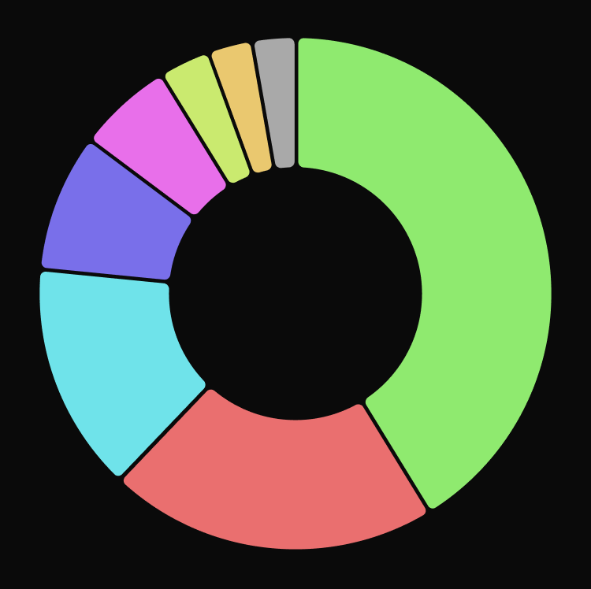
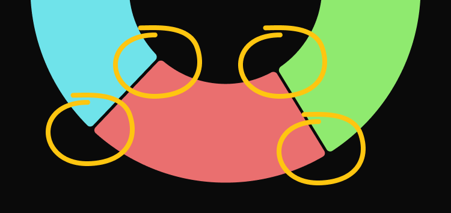

# Build a donut chart with rounded corners in SwiftUI
## Description
I need help with creating a donut chart in SwiftUI where each slice has slightly rounded corners.

I'm currently using a hack that doesn't do that trick and would like you to create a shape that would display each slice with 4px rounded corners on all sides, like in the expected designs

## Few things to note:

- The data in the pie chart would be dynamic, so the shapes should not be just hard coded. I've included a code that autogenerates data to help you ensure that.
- The difference between outer and inner chart radius should always be 84 px.
- The code should handle the edge case when the size of a pie slice is too small to show a regular rounded corners and instead decrease it relative to the size of the slice (e.g. if the slice is less than ~4 degrees, the rounding should become smaller).
- Your code should work in a SwiftUI project and ideally not use external library dependencies.
- Expected outcome as a result of this project is just a code snippet / GitHub project of the shape creation logic that takes into account all of the context above.

Happy to jump on a call or answer questions asynchronously, if you require more context.
